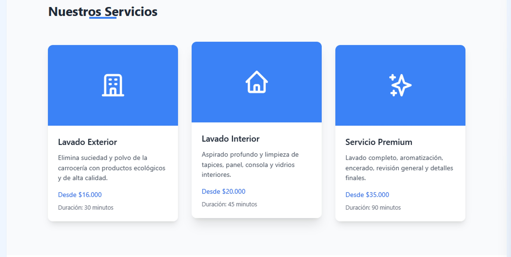
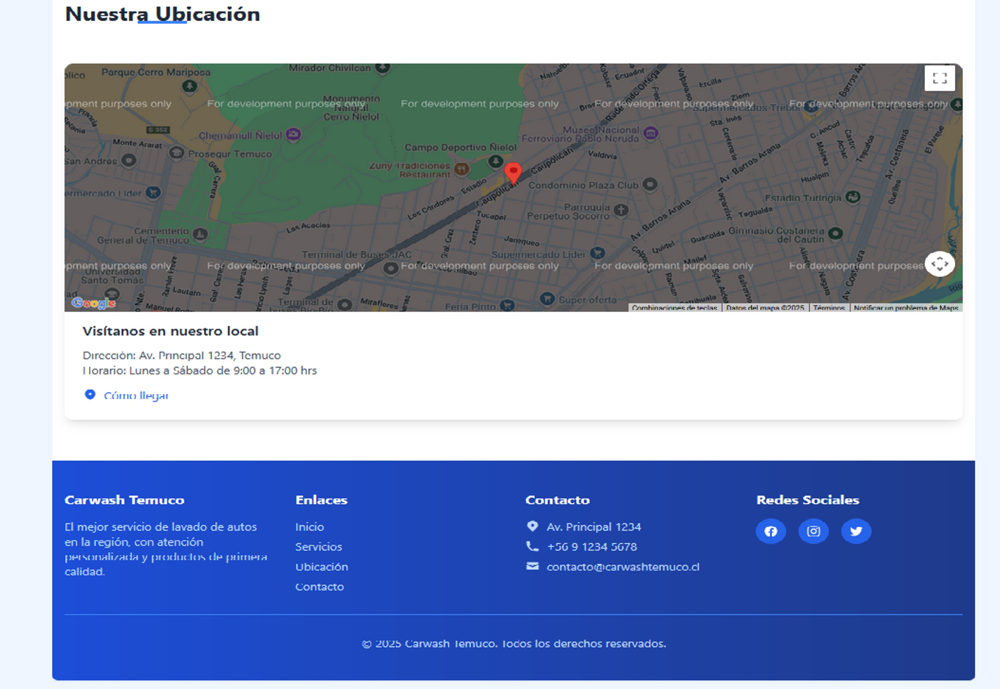
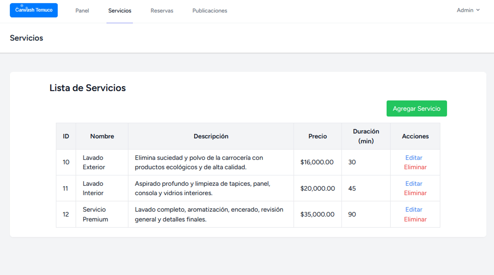
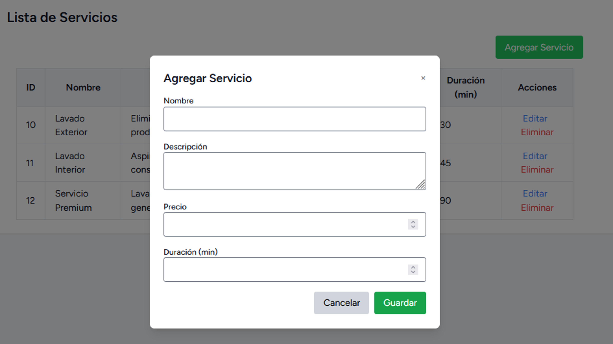

<p align="center"><a href="https://laravel.com" target="_blank"></a></p>

<p align="center">
<a href="https://github.com/laravel/framework/actions"></a>
<a href="https://packagist.org/packages/laravel/framework"></a>
<a href="https://packagist.org/packages/laravel/framework"></a>
<a href="https://packagist.org/packages/laravel/framework"></a>
</p>

## Sistema de Reservas Carwash

Aplicación web desarrollada en Laravel para gestionar reservas de lavado de autos. Los usuarios pueden seleccionar el servicio deseado, ingresar su vehículo y elegir fecha y hora de la reserva.

## 🛠️ Tecnologías utilizadas
- PHP 8.3
- Laravel 11
- MySQL
- Tailwind CSS
- Blade
- JavaScript

## 📸 Capturas de pantalla







## 🚀 Funcionalidades principales

- Registro y login de usuarios (Laravel Breeze)
- Creación, edición y eliminación de reservas
- Gestión de servicios (lavado básico, lavado completo, etc.)
- Panel de administración para ver reservas
- Validaciones y mensajes de error amigables

## ⚙️ Instalación del proyecto
1. Clona el repositorio:
```bash
git clone https://github.com/RudyAMedina/ProyectoCarwash.git
cd ProyectoCarwash
```
2. Instala dependencias de Laravel:
```bash
composer install
```
3. Copia y configura el archivo .env:
```bash
cp .env.example .env
php artisan key:generate
```
4. Configura la base de datos en .env y ejecuta las migraciones:
```bash
php artisan migrate --seed
```
5. Inicia el servidor:
```bash
php artisan serve
```


The Laravel framework is open-sourced software licensed under the [MIT license](https://opensource.org/licenses/MIT).
